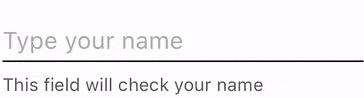

# MaterialTextView



## Description
This is QIWI's implementation of text field/view according to Material Design. It doesn't have performance issues and it supports both single- and multiline modes. Also, it supports formattable input with masks since it uses [FormattableTextView](https://github.com/qiwi/FormattableTextView).

This component uses MVVM pattern and it is highly customizable via styles in real time.
You can check user input for validity manually by firing viewModel's `validate()` method (it checks the text according to `actionValidator` property) or automatically during user's input by setting `inputValidator` property.

Placeholder has 2 modes: animatable and normal.

## Requirements
* iOS 9.0+

## Installation

### CocoaPods
```
pod 'MaterialTextView', :git => 'https://github.com/qiwi/MaterialTextView'
```

### Carthage
```
git "https://github.com/qiwi/MaterialTextView" "master"
```

## Usage

### Example
```swift
let vm = MaterialTextViewModel(text: "Text", inputValidator: { text in
			guard let text = text else { return .valid }
			return text.count > 5 ? .invalid(text: "Text is too long") : .valid
		})
let view = MaterialTextView(viewModel: vm)
```

## License
Distributed under the MIT License.